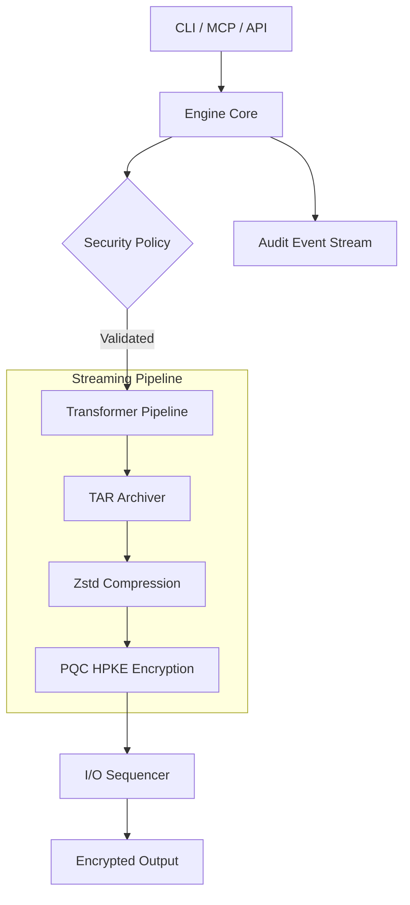

# Maknoon (مكنون)
> **Enterprise-Grade Post-Quantum Encryption Engine and MCP Server**

[](https://github.com/al-Zamakhshari/maknoon/releases)
[](https://opensource.org/licenses/MIT)
[](https://goreportcard.com/report/github.com/al-Zamakhshari/maknoon)

Maknoon is an industrial-grade cryptographic engine and Model Context Protocol (MCP) server designed to secure data against classical and quantum computational threats. By implementing NIST-standardized Post-Quantum Cryptography (PQC) within a constant-memory streaming architecture, Maknoon provides a scalable, zero-OS sandbox for securing sensitive assets.

## Executive Summary
Maknoon utilizes a **Unified Binary Architecture**—hosting both its CLI and native MCP server in a single, statically linked binary. It offers dual-transport capabilities for AI agents (Stdio/SSE), features industrial-grade diagnostic tracing via `--trace`, and features a physically isolated container sandbox to prevent unauthorized data access.

---

## Capabilities

| Feature | Technical Specification |
| :--- | :--- |
| **PQC Encryption** | Hybrid HPKE (RFC 9180) utilizing ML-KEM-1024 (Kyber) and X25519. |
| **Digital Signatures** | ML-DSA-87 (Dilithium) for high-integrity provenance. |
| **Dual-Transport MCP** | Support for local `stdio` and remote `sse` (HTTPS) agent integrations. |
| **Secure Transport** | Native **Post-Quantum TLS 1.3** prioritization (ML-KEM hybrid). |
| **Streaming Engine** | 64KB chunked pipeline ensuring $O(1)$ memory complexity. |
| **Observability** | Structured internal tracing (`--trace`) with automatic PII redaction. |
| **Container Sandbox** | Minimal 13MB `scratch` build with zero OS attack surface. |
| **Configuration** | Standardized **Viper** management with environment-variable overrides. |

---

## Installation

### Homebrew (macOS/Linux)
```bash
brew install al-Zamakhshari/tap/maknoon
```

### From Source (Makefile)
```bash
git clone https://github.com/al-Zamakhshari/maknoon
cd maknoon
make build
```

---

## Core Usage

### Identity Management
Generate and manage PQC identities. Supports hardware-bound protection via FIDO2.
```bash
# Generate a new PQC identity
maknoon keygen -o production_id --profile nist
```

### Data Protection
Orchestrate archival, compression, and PQC encryption in a single stream.
```bash
# Encrypt for multiple recipients
maknoon encrypt dataset.tar.gz -p user1.pub -p user2.pub

# Inspect metadata without decryption
maknoon info dataset.makn
```

---

## Enterprise Integrations

### Model Context Protocol (MCP)
Maknoon operates as a native MCP server for AI agents. Remote deployments are secured via PQ-TLS.

| Transport | Description |
| :--- | :--- |
| **Stdio** | Local integration for IDEs (Cursor) and Desktop agents (Claude). |
| **SSE** | Secure remote gateway for cloud-native agentic microservices. |

```bash
# Start a secure remote SSE gateway
maknoon mcp --transport sse --address :8443 --tls-cert server.crt --tls-key server.key
```

### Industrial Sandbox
For maximum isolation, deploy Maknoon as a containerized sidecar. The image is derived from an empty `scratch` layer, containing only the immutable binary.

```bash
# Launch a physically isolated sandbox
docker run -v ~/workspace:/home/maknoon -e MAKNOON_AGENT_MODE=1 maknoon-sandbox
```

---

## Architecture



### Constant-Memory Streaming
The engine utilizes a parallel **Sequencer Model**. Input streams are divided into 64KB blocks, processed independently by a worker pool, and reassembled by the sequencer. This ensures a stable memory footprint (~13MB) regardless of file size.

### Deterministic Memory Hygiene
All sensitive material (FEKs, private key shards) is stored in specialized buffers. These buffers are explicitly zeroed out using `SafeClear` patterns immediately upon completion of the operation.

---

## Technical Deep-Dive
For a comprehensive understanding of the platform's internal mechanics, refer to the following specifications in the [Wiki](https://github.com/al-Zamakhshari/maknoon/wiki):

*   **[[Architecture]]**: Detailed analysis of the Sequencer Model and Unified Binary design.
*   **[[Security Rationale]]**: Deep dive into the Post-Quantum cryptographic stack and transport security.
*   **[[Agent Integration]]**: Standardized instructions for Model Context Protocol (MCP) orchestration.
*   **[[CLI Reference]]**: Scannable technical specification of the entire command hierarchy.

---

## License
This project is licensed under the MIT License.
