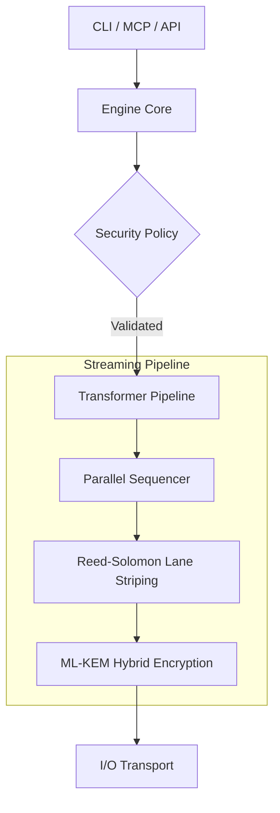

# Maknoon (مكنون)
> **Industrial Post-Quantum Encryption Engine & Resilient MCP Gateway**

[](https://github.com/al-Zamakhshari/maknoon/releases)
[](https://opensource.org/licenses/MIT)
[](https://goreportcard.com/report/github.com/al-Zamakhshari/maknoon)

Maknoon is an industrial-grade cryptographic engine and Model Context Protocol (MCP) server designed to secure data against classical and quantum threats. It features a **RAID-for-Networking** L4 tunnel system, hybrid PQC encryption, and a constant-memory streaming architecture.

---

## 🚀 Key Capabilities

| Feature | Specification |
| :--- | :--- |
| **Hybrid PQC** | NIST ML-KEM-1024 (Kyber) + X25519 (RFC 9180). |
| **Non-Lattice** | **Conservative Profile**: FrodoKEM-640 + SLH-DSA fallback. |
| **Resilient Tunnels** | **Phase 7.4**: RAID-for-Networking surviving up to 66% lane failure. |
| **Cipher Stack** | AES-256-GCM (Encryption) + ML-DSA-87 (Forensic Signatures). |
| **Unified Binary** | CLI, MCP (Stdio/SSE), and **Enterprise REST API**. |
| **Threshold Sig** | **Phase 6.1**: M-of-N Post-Quantum digital signatures. |
| **Privacy RAID** | Fragment dispersal (Shamir + Erasure Coding) for data at rest. |

---

## 🛠 Installation

### Homebrew (macOS/Linux)
```bash
brew install al-Zamakhshari/tap/maknoon
```

### From Source
```bash
git clone https://github.com/al-Zamakhshari/maknoon
cd maknoon
make build
```

---

## 📖 Practical Examples

### 1. Post-Quantum Identity & Data Protection
Generate a hardware-compliant identity and encrypt data for multiple recipients.
```bash
# 1. Generate an identity bound to a specific profile
maknoon keygen -o alice_id --profile nist

# 2. Encrypt a directory into a PQC-secured archive
maknoon encrypt ./sensitive_data -p bob.pub -p charlie.pub --sign-key alice.key -o bundle.makn

# 3. Inspect the cryptographic provenance without decrypting
maknoon info bundle.makn --json
```

### 2. Resilient L4 Tunnels (Phase 7.4)
Establish a user-space tunnel that stripes data across multiple parallel sessions. Survives lane drops and network instability.
```bash
# 1. Start a PQC Listener on the remote side
maknoon tunnel listen --p2p --address ":4433"

# 2. Establish a resilient gateway with 2 data lanes and 2 parity lanes
maknoon tunnel start --remote "gateway.internal:4433" --data-lanes 2 --parity-lanes 2 --port 1080

# 3. Use the tunnel via SOCKS5
curl --proxy socks5h://127.0.0.1:1080 http://internal-service.local
```

### 3. AI Agent Integration (MCP)
Expose Maknoon's PQC toolkit to AI agents (Cursor, Claude Desktop, etc.).
```bash
# Start a local MCP server (Stdio)
maknoon mcp --transport stdio

# Start a remote SSE gateway for cloud agents
maknoon mcp --transport sse --address ":8443" --tls-cert cert.pem --tls-key key.pem
```

### 4. Fragmented Dispersal (RAID-for-Privacy)
Split a sensitive file into encrypted fragments stored across different volumes or cloud providers.
```bash
# Disperse a file into 5 shards (any 3 required for reconstruction)
maknoon fragment data.zip --shards 5 --threshold 3 --out ./shard_dir/

# Reassemble from the fragments
maknoon reassemble ./shard_dir/ -o restored_data.zip
```

---

## 🛡 Security Architecture


```mermaid
graph TD
    A[CLI / MCP / API] --> B[Engine Core]
    B --> C{Security Policy}
    C -- Validated --> D[Transformer Pipeline]
    subgraph Pipeline [Streaming Pipeline]
        D --> E[Parallel Sequencer]
        E --> F[Reed-Solomon Lane Striping]
        F --> G[ML-KEM Hybrid Encryption]
    end
    G --> H[I/O Transport]
```

### Skeptical Engineering
Maknoon is built on the principle of **Empirical Rigor**. Every cryptographic transformation is verified via Power-On Self-Tests (POST), and all sensitive memory is explicitly zeroized using the `memguard` enclave to prevent leakage via swap or core dumps.

---

## 🏆 Documentation & Knowledge Base
For detailed technical specifications and user guides, refer to the [Documentation Hub](./docs/):

*   **[Getting Started](./docs/getting-started/INSTALL.md)**: Installation and Hardware Hardening.
*   **[Architecture](./docs/architecture/overview.md)**: Sequencer model and memory safety.
*   **[Resilient Networking](./docs/user-guides/tunnels.md)**: Deep-dive into Tunnels and Reed-Solomon.
*   **[Security Rationale](./docs/architecture/threat-model.md)**: Choice of Kyber, Dilithium, and AES-GCM.
*   **[CLI Reference](./docs/integration/cli-reference.md)**: Full command and flag specification.
*   **[AI Agent Integration](./docs/integration/mcp-server.md)**: Native MCP tool schemas.

---


## License
MIT License. Created by [al-Zamakhshari](https://github.com/al-Zamakhshari).
