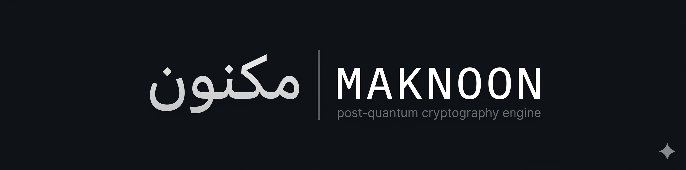

<p align="center">
  
</p>

[](https://github.com/al-Zamakhshari/maknoon/releases)
[](https://github.com/al-Zamakhshari/maknoon/actions/workflows/ci.yml)
[](LICENSE)
[](https://goreportcard.com/report/github.com/al-Zamakhshari/maknoon)

Maknoon is a post-quantum cryptographic engine and MCP gateway — a single ~12 MB binary that lets AI agents and CLI users encrypt data, manage secrets, sign documents, and publish verifiable identities, all secured against classical and quantum adversaries.

---

## Features

| | Specification |
|---|---|
| **Hybrid PQC Encryption** | ML-KEM-768 + X25519 (NIST standard). Conservative option: FrodoKEM-640 |
| **Post-Quantum Signatures** | ML-DSA-87; M-of-N threshold aggregation |
| **Encrypted Vault** | Argon2id-protected secrets; quorum unlock; brute-force lockout; export/import |
| **Identity Registry** | WKD (HTTPS static file) and DNS TXT — no infrastructure required |
| **RAID-for-Privacy** | Reed-Solomon fragment dispersal; compose with rclone for multi-cloud distribution |
| **Forensic Audit Log** | Hash-chained, ML-DSA-87 signed operation log; tamper detection |
| **MCP Server** | 45 PQC tools for AI agents via stdio or SSE; `gh skill install` supported |
| **Session-Keyed Encryption** | Derive once, encrypt thousands of files with no per-file KDF cost |

---

## Installation

```bash
# Homebrew (macOS / Linux)
brew install al-Zamakhshari/tap/maknoon

# GitHub Releases — pre-built binaries for linux/darwin/windows amd64/arm64
# https://github.com/al-Zamakhshari/maknoon/releases

# From source
git clone https://github.com/al-Zamakhshari/maknoon
cd maknoon && make build
```

`mkn` is installed as a short alias alongside the binary by all package managers. To add it manually:
```bash
alias mkn=maknoon   # add to ~/.bashrc or ~/.zshrc
```

---

## Quick Start

### Encrypt and decrypt

```bash
# Generate a keypair
maknoon keygen -o alice

# Symmetric (passphrase)
maknoon encrypt report.pdf -o report.pdf.makn
maknoon decrypt report.pdf.makn -o report.pdf

# Asymmetric — multi-recipient (keys resolved from WKD or DNS)
maknoon encrypt report.pdf -p @alice@corp.com -p @bob@corp.com -o report.pdf.makn
maknoon decrypt report.pdf.makn -k alice.kem.key -o report.pdf

# Inspect header without decrypting
maknoon info report.pdf.makn --json
```

### Vault — encrypted secret storage

```bash
maknoon vault set DEPLOY_TOKEN --vault prod
maknoon vault get DEPLOY_TOKEN --vault prod

# Export / import for migration between machines
maknoon vault export --vault prod -o prod.vault.makn
maknoon vault import --vault restored -i prod.vault.makn

# Quorum-governed institutional vault (3-of-5 unlock)
maknoon vault init-institutional --vault corp --threshold 3 --shares 5
```

### Identity — publish and resolve

```bash
# Publish your public key via HTTPS (WKD — no DNS changes needed)
maknoon keygen -o alice
maknoon identity publish @alice@example.com --wkd
# → Upload the generated JSON to:
#   https://example.com/.well-known/maknoon/alice.json

# Auto-publish via DNS (deSEC.io)
maknoon identity publish @alice@example.com --desec

# Others can now encrypt directly to you
maknoon encrypt secret.txt -p @alice@example.com -o secret.makn
```

### Threshold signatures

```bash
maknoon sign contract.pdf -k alice.sig.key -o alice.sig
maknoon sign contract.pdf -k bob.sig.key -o bob.sig
maknoon sign aggregate alice.sig bob.sig -o combined.sig
maknoon verify contract.pdf --signature combined.sig \
    -p alice.sig.pub -p bob.sig.pub --threshold 2
```

### RAID-for-Privacy with rclone

Fragment encrypted files and distribute shards across cloud providers. Any N-of-(N+M) shards reconstruct the original — no single provider sees a complete file.

```bash
# Fragment into 5 data + 3 parity shards; keep manifest locally
maknoon encrypt classified.pdf -o classified.makn
maknoon fragment classified.makn --data 5 --parity 3 \
    --output /tmp/shards/ --output-manifest ~/manifests/classified.json

# Distribute across three providers
rclone sync /tmp/shards/ s3:my-bucket/shards/
rclone copy /tmp/shards/shard_005.maknf gcs:backup/shards/
rclone copy /tmp/shards/shard_006.maknf azure:container/shards/
maknoon shred /tmp/shards/

# Recover: fetch any 5 shards, verify SHA-256 against manifest
rclone copy s3:my-bucket/shards/ /tmp/recover/
cp ~/manifests/classified.json /tmp/recover/manifest.json
maknoon reassemble /tmp/recover/ --output classified.makn --verify
maknoon decrypt classified.makn -o classified.pdf
```

See [fragment distribution guide](docs/user-guides/fragment-distribution.md) for the full rclone workflow.

### Bulk encryption with session keys

Argon2id runs once; all files share the derived key — eliminating the 26 ms/file KDF cost at scale.

```bash
KEY=$(maknoon session derive --passphrase "$PASS")
for f in documents/*.pdf; do
  maknoon encrypt "$f" --session-key "$KEY" -o "${f}.makn"
done
```

---

## AI Agent Integration

### Install the agent skill

```bash
gh skill install al-Zamakhshari/maknoon maknoon
```

This configures Maknoon's MCP server in your agent host (Claude Code, Cursor, etc.) and loads the operational instructions from [`.github/skills/maknoon/SKILL.md`](.github/skills/maknoon/SKILL.md).

### Manual MCP configuration

**stdio** (Claude Desktop, Cursor):

```json
{
  "mcpServers": {
    "maknoon": {
      "command": "maknoon",
      "args": ["mcp", "--transport", "stdio"],
      "env": { "MAKNOON_PASSPHRASE": "your-passphrase" }
    }
  }
}
```

**SSE** (remote agents, Kubernetes):

```bash
maknoon serve --address :8443 --tls-cert cert.pem --tls-key key.pem
```

**Call tools from the CLI** (scripting / CI):

```bash
maknoon call encrypt_file --addr localhost:8443 \
    --args '{"input":"report.pdf","output":"report.pdf.makn"}'
```

### MCP tool categories (45 tools)

| Category | Tools |
|---|---|
| **crypto** | `encrypt_file`, `decrypt_file`, `sign_file`, `verify_file`, `inspect_file`, `shred_file`, `reencrypt_file`, `gen_passphrase`, `gen_password` |
| **vault** | `vault_get/set/list/delete/rename`, `vault_set_blob/get_blob` (agent memory), `vault_split/recover`, `vault_init_institutional`, `vault_status`, `vault_check_shards` |
| **identity** | `identity_keygen/list/info/rename/delete/split/combine/publish`, `contact_add/list/delete`, `resolve_identity`, `aggregate_signatures` |
| **dispersal** | `fragment_file`, `reassemble_file` |
| **config** | `config_list/update/init`, `diagnostic`, `audit_export`, `audit_verify` |
| **profiles** | `profiles_list/gen/rm` |

---

## Security

### Design principles

- **Constant-memory streaming** — encrypts arbitrarily large files with bounded RSS
- **Explicit zeroization** — all key material held in `memguard`-locked buffers; zeroed after use
- **Identity expiry** — published records expire after 48h; replayed stale records are rejected
- **Vault lockout** — 10 failed unlock attempts triggers a 15-minute lockout
- **Agent-mode sandbox** — file paths constrained to home/vault/tmp when running as an MCP server
- **Forensic audit** — every operation logged with SHA-256 hash chaining and ML-DSA-87 signatures

```bash
maknoon audit export   # view operation history
maknoon audit verify   # verify log integrity (detect tampering)
```

### Performance

| Operation | Throughput | Notes |
|---|---|---|
| Encrypt 10 MB (8 workers) | ~384 MB/s | Near memory bandwidth |
| Encrypt 100 MB | ~3.3 GB/s | Large-buffer amortization |
| Session-key encrypt 1 KB | ~2,000 MB/s | No per-file KDF |
| Encrypt 1 KB (with KDF) | ~0.04 MB/s | 26 ms Argon2id dominates |
| ML-DSA-87 sign/verify | ~1 ms | Per operation |

Run `make bench` for measurements on your hardware.

### Vulnerability disclosure

Security issues: **akhallaf@gmail.com** — see [SECURITY.md](SECURITY.md).

---

## What Maknoon is not

- **Not a VPN** — use [WireGuard](https://www.wireguard.com) or [Tailscale](https://tailscale.com) for encrypted tunnels
- **Not a chat app** — use Signal or a Matrix client for secure messaging
- **Not a cloud backup tool** — fragment dispersal gives you the erasure coding; rclone gives you the cloud transport

---

## Documentation

| | |
|---|---|
| [Install & hardware hardening](docs/getting-started/INSTALL.md) | TPM 2.0, secure deletion on SSDs |
| [Architecture](docs/architecture/overview.md) | Streaming pipeline, MCP transport, identity registry |
| [Threat model](docs/architecture/threat-model.md) | Algorithm choices, known limitations |
| [CLI reference](docs/integration/cli-reference.md) | All commands and flags |
| [MCP server](docs/integration/mcp-server.md) | Tool schemas, SSE setup |
| [Session keys](docs/user-guides/session-keys.md) | Bulk encryption without per-file KDF cost |
| [Fragment + rclone](docs/user-guides/fragment-distribution.md) | RAID-for-Privacy with cloud distribution |
| [Remote agent](docs/user-guides/remote-agent.md) | `maknoon call`, SSE server, PQC TLS |
| [Changelog](CHANGELOG.md) | Release history |
| [Contributing](CONTRIBUTING.md) | Dev setup, security requirements, PR process |

---

## License

MIT — created by [al-Zamakhshari](https://github.com/al-Zamakhshari).
