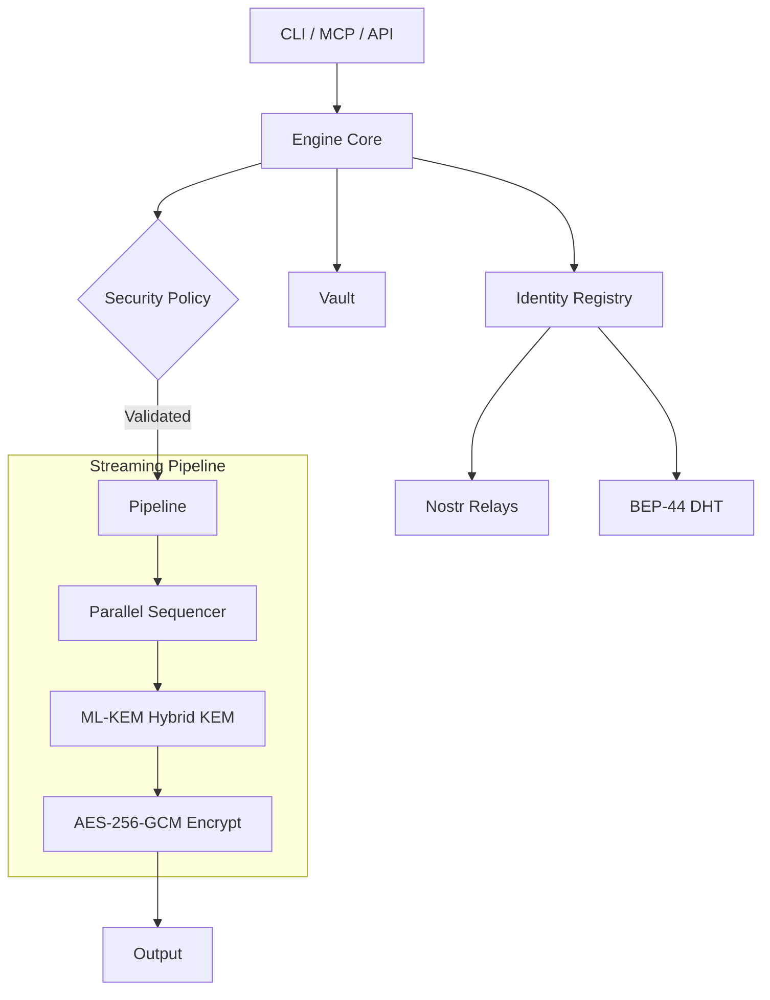

# Maknoon (مكنون)
> **Post-Quantum Cryptography for AI Agents**

[](https://github.com/al-Zamakhshari/maknoon/releases)
[](https://opensource.org/licenses/MIT)
[](https://goreportcard.com/report/github.com/al-Zamakhshari/maknoon)

Maknoon is a post-quantum cryptographic engine and MCP gateway. It lets AI agents and CLI users encrypt data, manage secrets, and publish verifiable identities — all secured against both classical and quantum adversaries.

---

## Key Capabilities

| Feature | Specification |
| :--- | :--- |
| **Hybrid PQC Encryption** | ML-KEM-768 + X25519 (X-Wing). Conservative option: FrodoKEM-640. |
| **Post-Quantum Signatures** | ML-DSA-87 for integrated signing and M-of-N threshold signatures. |
| **Encrypted Vault** | Argon2id-protected secrets with quorum unlock and brute-force lockout. |
| **Decentralised Identity** | Self-signed records on Nostr (primary) → BEP-44 DHT → DNS. |
| **Session-Keyed Encryption** | Derive a key once, encrypt thousands of files with no per-file KDF cost. |
| **MCP Server** | ~25 PQC tools for AI agents via stdio or SSE transport. |
| **Multi-Recipient Encrypt** | Encrypt for @alice + @bob simultaneously; keys resolved from the registry. |

---

## Installation

```bash
# Homebrew (macOS/Linux)
brew install al-Zamakhshari/tap/maknoon

# From source
git clone https://github.com/al-Zamakhshari/maknoon && cd maknoon && make build
```

---

## Practical Examples

### 1. Multi-Recipient PQC Encryption
Encrypt a file for multiple recipients whose public keys are resolved from the decentralised registry.

```bash
# Publish identities to the registry (each user does this once)
maknoon keygen -o alice_id --profile nist
maknoon identity publish @alice --name alice_id

# Encrypt for both alice and bob — keys resolved automatically
maknoon encrypt ./secret.txt -p @alice -p @bob -o secret.makn

# Either recipient can decrypt with their private key
maknoon decrypt secret.makn -k alice_id --passphrase mypass -o secret.txt

# Inspect provenance without decrypting
maknoon info secret.makn --json
```

### 2. Encrypted Vault
Store and retrieve secrets with Argon2id-derived keys and optional quorum unlock.

```bash
# Store a secret
maknoon vault set MY_API_KEY --vault prod --passphrase vault_pass

# Retrieve it
maknoon vault get MY_API_KEY --vault prod --passphrase vault_pass

# Session-keyed bulk encryption (no per-file KDF overhead)
KEY=$(maknoon session derive --passphrase mypass)
maknoon encrypt file1.txt --session-key "$KEY" -o file1.makn
maknoon encrypt file2.txt --session-key "$KEY" -o file2.makn
```

### 3. AI Agent Integration (MCP)
Expose Maknoon's PQC toolkit to AI agents (Claude Desktop, Cursor, etc.).

```bash
# stdio transport — direct integration with MCP-compatible agents
maknoon mcp --transport stdio

# SSE transport — for cloud agents or multi-user deployments
maknoon mcp --transport sse --address ":8443" --tls-cert cert.pem --tls-key key.pem
```

**Available MCP tool categories:**
- **crypto** — encrypt, decrypt, sign, verify, aggregate signatures, key wrap/unwrap
- **vault** — set, get, list, delete, rotate, quorum unlock
- **identity** — keygen, publish, resolve, delete, rotate
- **workspace** — create ephemeral RAM-disk workspace, shred on completion

**Example agent workflow:**
```
Agent: "Store this API key securely"
→ vault_set(service="API_KEY", password="sk-...", vault="agent_memory")

Agent: "Encrypt this report for alice and send it"  
→ identity_resolve(handle="@alice")
→ encrypt_file(input="report.pdf", recipients=["@alice"])
```

### 4. Threshold Signatures
M-of-N post-quantum signing for multi-party authorization.

```bash
# Sign with two different keys
maknoon sign document.pdf -k alice.sig.key -o alice.sig
maknoon sign document.pdf -k bob.sig.key -o bob.sig

# Aggregate and verify with 2-of-2 threshold
maknoon sign aggregate alice.sig bob.sig -o combined.sig
maknoon verify document.pdf --signature combined.sig --threshold 2
```

---

## Security Architecture


```mermaid
graph TD
    A[CLI / MCP / API] --> B[Engine Core]
    B --> C{Security Policy}
    C -- Validated --> D[Pipeline]
    subgraph Pipeline [Streaming Pipeline]
        D --> E[Parallel Sequencer]
        E --> F[ML-KEM Hybrid KEM]
        F --> G[AES-256-GCM Encrypt]
    end
    G --> H[Output]
    B --> I[Vault]
    B --> J[Identity Registry]
    J --> K[Nostr Relays]
    J --> L[BEP-44 DHT]
```

### Design Principles
- **Constant-memory streaming** — encrypts arbitrarily large files with bounded RSS
- **Explicit zeroization** — all key material cleared from memory after use
- **Identity expiry** — published records expire after 48h; replayed stale records are rejected
- **Vault lockout** — 10 failed attempts triggers a 15-minute lockout (configurable)
- **Agent-mode restrictions** — file paths constrained to home/vault/tmp in MCP mode

### Performance

| Operation | Throughput | Notes |
| :--- | :--- | :--- |
| Encrypt 10 MB (8 workers) | ~384 MB/s | Near memory bandwidth |
| Encrypt 100 MB | ~3.3 GB/s | Large-buffer amortization |
| Session-key encrypt 1 KB | ~2,000 MB/s | No per-file KDF cost |
| Encrypt 1 KB (with KDF) | ~0.04 MB/s | 26 ms Argon2id dominates |
| ML-DSA-87 sign/verify | ~1 ms | Per operation |

Use `make bench` for measurements on your hardware. Use `maknoon session derive` to eliminate KDF overhead for bulk small-file encryption.

---

## What Maknoon is NOT

- **Not a VPN.** For encrypted tunnels, use [Wireguard](https://www.wireguard.com) or [Tailscale](https://tailscale.com).
- **Not a chat app.** For secure messaging, use Signal or a Nostr client.
- **Not a general file sync tool.** Fragment dispersal (`maknoon fragment`) is experimental and requires manual shard management without a storage backend integration.

---

## Documentation

- **[Getting Started](./docs/getting-started/INSTALL.md)** — Installation and hardware hardening
- **[Architecture](./docs/architecture/overview.md)** — Sequencer model and memory safety
- **[Security Rationale](./docs/architecture/threat-model.md)** — Algorithm choices and known limitations
- **[CLI Reference](./docs/integration/cli-reference.md)** — Full command and flag specification
- **[AI Agent Integration](./docs/integration/mcp-server.md)** — MCP tool schemas
- **[Roadmap](./docs/architecture/roadmap.md)** — Planned features
- **[Changelog](./CHANGELOG.md)** — Release history

---

## License

MIT License. Created by [al-Zamakhshari](https://github.com/al-Zamakhshari).
