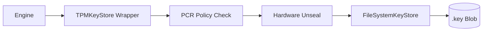

# Hardware Hardening Guide
> **Binding Maknoon Identities to Silicon Trust (TPM 2.0)**

Maknoon supports industrial-grade hardware hardening via TPM 2.0, ensuring that private cryptographic material never exists in plaintext within host memory.

---

## 🛡️ TPM 2.0: Platform Configuration Binding

TPM hardening seals keys to the specific state of your hardware. If the bootloader is tampered with or Secure Boot is disabled, the TPM will refuse to unseal the keys.

### Requirements
*   A Linux environment with `/dev/tpmrm0` (TPM Resource Manager).
*   TPM 2.0 compliant hardware.

### Basic Sealing
Generate an identity where the private keys are encrypted by the TPM's Storage Root Key (SRK).
```bash
maknoon keygen corporate-id --tpm
```

### PCR-Bound Sealing (Advanced)
Bind keys to specific **Platform Configuration Registers (PCRs)**:
*   **PCR 0**: Core System Firmware.
*   **PCR 7**: Secure Boot State.
*   **PCR 14**: Kernel Measurement.

```bash
# Key only unlocks if Secure Boot is active and the kernel hasn't changed
maknoon keygen secure-id --tpm --tpm-pcrs 7,14
```

### Usage
Pass `--tpm` to any operation using a TPM-protected identity:
```bash
maknoon encrypt sensitive.pdf --identity secure-id --tpm
```

---

## 🏗️ Technical Architecture

Maknoon uses a **Layered KeyStore Wrapper** pattern:
1.  **Base Layer**: Filesystem (encrypted blobs).
2.  **Middle Layer**: TPM Wrapper (seals/unseals blobs using hardware-protected policy sessions).
3.  **App Layer**: The Engine interacts with the standard `KeyStore` interface, remaining agnostic to hardware complexity.



### Forensic Integrity
All hardware access attempts (success or failure) are recorded in the **Chained Forensic Audit Log**:
*   **Action**: `load_identity`
*   **Meta**: `tpm: true, pcrs: [7,14]`

---

## ⚠️ Secure Deletion Limitations (SSD / NVMe)

Maknoon's `--shred` flag performs a single-pass zero-overwrite, random rename, and `unlink`. This provides **logical-layer hygiene** — the file is inaccessible through the filesystem — but **does not guarantee physical data erasure on flash storage**.

### Why SSDs defeat logical overwrite

SSDs and NVMe drives use a Flash Translation Layer (FTL) that maps logical block addresses to physical NAND cells for wear-leveling. When a block is overwritten, the FTL typically:
1. Writes new data to a **different** physical cell
2. Marks the old cell as available for deferred garbage collection

The old cell — containing original plaintext — may remain physically readable for days to weeks until the internal garbage collector reclaims it.

### Mitigation: Full Disk Encryption is the primary control

| Storage Type | `--shred` effectiveness | Recommended primary control |
| :--- | :--- | :--- |
| HDD (spinning disk) | High — logical = physical sector overwrite | `--shred` sufficient; `hdparm --security-erase` for decommission |
| SSD / NVMe | Low — FTL wear-leveling redirects writes | **FDE (LUKS2 / FileVault / BitLocker)** |
| SD card / eMMC | Very low — aggressive wear-leveling | **FDE** + manufacturer Secure Erase if supported |

With FDE active, any NAND cell recovered by an attacker contains only ciphertext — `--shred` residue is irrelevant because the disk key is not present.

### ATA Secure Erase (decommissioning)

For SSDs that correctly implement it, ATA Secure Erase instructs the drive firmware to cryptographically shred all user data:

```bash
# Check support
hdparm -I /dev/sdX | grep -i "erase"

# Issue Secure Erase (sets a temp password, erases, removes password)
hdparm --security-set-pass maknoon /dev/sdX
hdparm --security-erase maknoon /dev/sdX
```

> Not all SSDs implement ATA Secure Erase correctly. Verify with the manufacturer. Prefer FDE for production deployments.
