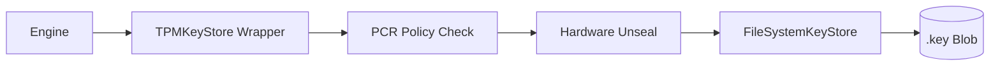

# Hardware Hardening Guide (Phase 8)
> **Binding Maknoon Identities to Silicon Trust (TPM 2.0 & FIDO2)**

Maknoon's Phase 8 introduces industrial-grade hardware hardening, ensuring that private cryptographic material never exists in plain-text within host memory. This guide covers the integration of TPM 2.0 (for platform binding) and FIDO2 (for human-presence verification).

---

## 🛡️ TPM 2.0: Platform Configuration Binding

TPM hardening allows you to seal keys to the specific state of your hardware. If the bootloader is tampered with or Secure Boot is disabled, the TPM will refuse to unseal the keys.

### 1. Requirements
*   A Linux environment with `/dev/tpmrm0` (TPM Resource Manager).
*   `go-tpm` compliant hardware (TPM 2.0).

### 2. Basic Sealing
Generate an identity where the private keys are encrypted by the TPM's Storage Root Key (SRK).
```bash
maknoon keygen corporate-id --tpm
```

### 3. PCR-Bound Sealing (Advanced)
You can bind keys to specific **Platform Configuration Registers (PCRs)**. Common PCRs include:
*   **PCR 0**: Core System Firmware.
*   **PCR 7**: Secure Boot State.
*   **PCR 14**: Kernel Measurement.

To generate a key that only unlocks if Secure Boot is active and the Kernel hasn't changed:
```bash
maknoon keygen secure-id --tpm --tpm-pcrs 7,14
```

### 4. Usage
When performing any operation (encryption, signing, vault access), simply pass the `--tpm` flag:
```bash
maknoon encrypt sensitive.pdf --identity secure-id --tpm
```

---

## 🔑 FIDO2: Human-Presence Verification

FIDO2 hardening binds key unlocking to a physical gesture (tapping a YubiKey or Nitrokey). This prevents "headless" malware from using your keys even if your machine is compromised.

### 1. Enrollment
Enroll your physical security key during identity generation. You will be prompted for your FIDO2 PIN.
```bash
maknoon keygen personal-id --fido2
```
*Note: This creates a `.fido2` metadata file alongside your `.key` file.*

### 2. Multi-Factor Unlocking
When using a FIDO2-protected identity, Maknoon will require:
1.  Your **Passphrase** (Something you know).
2.  Your **FIDO2 PIN** (Something you have/know).
3.  A **Physical Touch** (Something you do).

```bash
maknoon sign critical-manifest.json --identity personal-id
```

---

## 🏗️ Technical Architecture

Maknoon uses a **Layered KeyStore Wrapper** pattern:
1.  **Base Layer**: Filesystem (Encrypted Blobs).
2.  **Middle Layer**: TPM Wrapper (Seals/Unseals the blobs using hardware-protected policy sessions).
3.  **App Layer**: The Engine interacts with the standard `KeyStore` interface, remaining agnostic to the hardware complexity.



### Forensic Integrity
All hardware access attempts (success or failure) are recorded in the **Chained Forensic Audit Log**.
*   **Action**: `load_identity`
*   **Meta**: `tpm: true, pcrs: [7,14]`

---

## ⚠️ Secure Deletion Limitations (SSD / NVMe)

Maknoon's `--shred` flag performs a single-pass zero-overwrite, random rename, and `unlink`. This provides **logical-layer hygiene** — the file is inaccessible through the filesystem — but **does not guarantee physical data erasure on flash storage**.

### Why SSDs defeat logical overwrite

SSDs and NVMe drives use a Flash Translation Layer (FTL) that maps logical block addresses (LBAs) to physical NAND cells for wear-leveling. When a block is overwritten, the FTL typically:
1. Writes new data to a **different** physical cell
2. Marks the old cell as available for deferred garbage collection

The old cell — containing original plaintext — may remain physically readable for days to weeks until the internal garbage collector reclaims it. Specialized forensic hardware can read NAND chips directly, bypassing the FTL entirely.

### Mitigation: Full Disk Encryption is the primary control

| Storage Type | `--shred` effectiveness | Recommended primary control |
| :--- | :--- | :--- |
| HDD (spinning disk) | High — logical = physical sector overwrite | `--shred` sufficient; `hdparm --security-erase` for decommission |
| SSD / NVMe | Low — FTL wear-leveling redirects writes | **FDE (LUKS2 / FileVault / BitLocker)** |
| SD card / eMMC | Very low — aggressive wear-leveling | **FDE** + manufacturer Secure Erase if supported |

With FDE active, any NAND cell recovered by an attacker contains only ciphertext — `--shred` residue is irrelevant because the disk key is not present.

### ATA Secure Erase (decommissioning)

For SSDs that correctly implement it, ATA Secure Erase instructs the drive firmware to cryptographically shred all user data:

```bash
# Check support
hdparm -I /dev/sdX | grep -i "erase"

# Issue Secure Erase (sets a temp password, erases, removes password)
hdparm --security-set-pass maknoon /dev/sdX
hdparm --security-erase maknoon /dev/sdX
```

> Not all SSDs implement ATA Secure Erase correctly. Verify with the manufacturer. Prefer FDE for production deployments.
